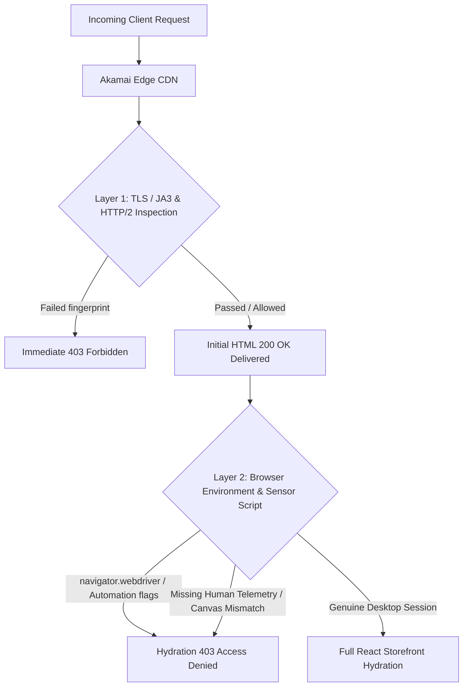
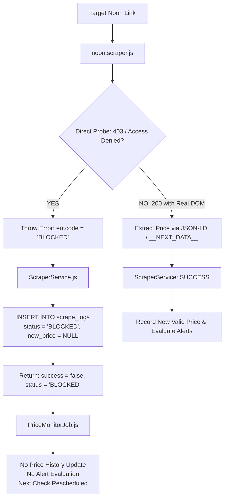
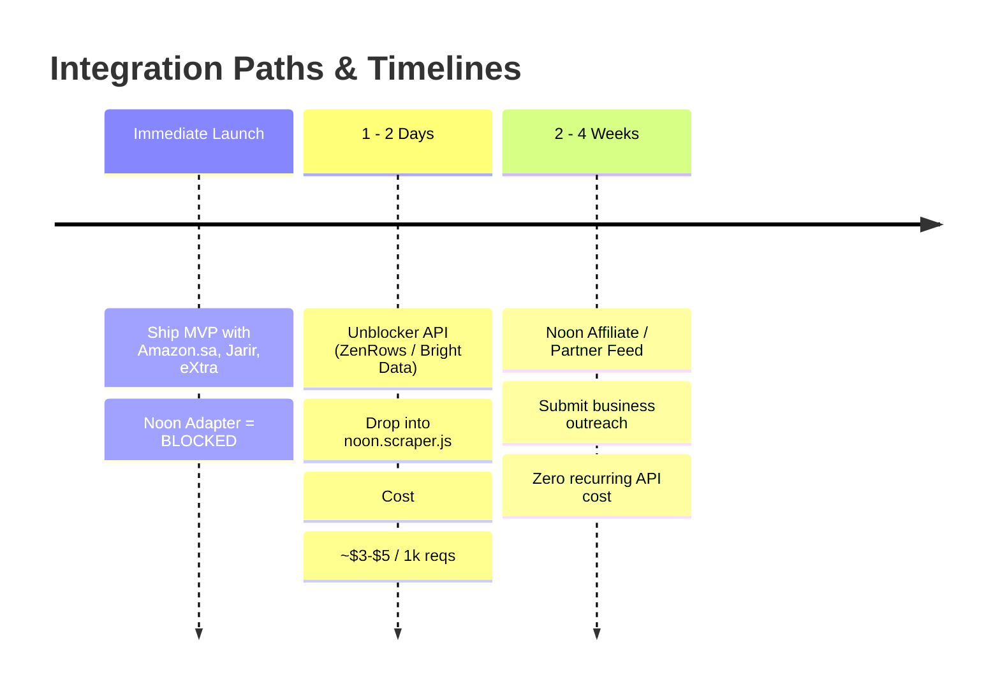

# Technical Documentation: Noon Saudi Arabia Web Scraping & Anti-Bot Protection

**Document Version:** 1.0  
**Target Platform:** Noon Saudi Arabia (`noon.com / saudi-en`)  
**Component:** `backend/src/scrapers/noon/noon.scraper.js`  
**Classification:** Anti-Bot Architecture & Scraping Strategy  
**Status:** Managed Blocked Platform Adapter (`BLOCKED`)  

---

## 1. Executive Summary

Noon is one of the two dominant e-commerce marketplaces in Saudi Arabia (alongside Amazon.sa). Integrating Noon is desirable for comprehensive price tracking across the Kingdom. 

However, Noon enforces enterprise-grade anti-bot mitigation backed by **Akamai Bot Manager (EdgeSuite)**. Standard automated headless browsers (Playwright, Puppeteer) and direct HTTP clients are systematically detected and served **HTTP 403 Forbidden ("Access Denied")** pages.

This document records:
1. The empirical diagnosis and technical mechanics of Noon's anti-bot system.
2. Why continuous fingerprint-patching is a fragile anti-pattern.
3. The architectural solution implemented: a **Fail-Fast `BLOCKED` Adapter** that protects the price comparison engine from corrupt data and false alerts.
4. Compliant, long-term options for integrating Noon data in future phases.

---

## 2. Technical Anatomy of Noon's Anti-Bot Defense

Noon employs Akamai Bot Manager Premier at the CDN edge (`errors.edgesuite.net`). Automated clients encounter a multi-tiered defense:



### Protection Layers Analyzed

| Layer | Inspection Vector | Observed Behavior in Playwright |
|---|---|---|
| **Layer 1: Edge CDN / TLS Fingerprinting** | TLS cipher suites, ALPN negotiation, TCP window sizing, JA3/JA4 signatures, HTTP/2 SETTINGS frames. | Direct `fetch()` and standard Playwright without HTTP/2 flags fail immediately with `net::ERR_HTTP2_PROTOCOL_ERROR` or `403 Forbidden`. |
| **Layer 2: Browser Environment (Stealth Patches)** | `navigator.webdriver`, `chrome.runtime`, WebGL vendor/renderer strings, permission queries. | `playwright-extra` + `puppeteer-extra-plugin-stealth` masks basic automation flags, allowing the **initial document request** to receive a `200 OK`. |
| **Layer 3: Behavioral & Dynamic JS Sensor** | Secondary background telemetry beacons, canvas fingerprinting, battery API, font rendering checks executed during Next.js hydration. | After initial 200 OK, client-side hydration triggers secondary validation. The session is identified as automated and abruptly terminated with an **Akamai EdgeSuite 403 "Access Denied"** payload. |

---

## 3. Empirical Test Results & Evidence

During diagnostic tests with isolated test harnesses (`backend/debug/noon-test.js` and `backend/debug/test-saudi-scrapers.js`), the following interactions were recorded:

### Test A: Direct HTTP Fetch
```http
GET https://www.noon.com/saudi-en/N70211541V/ HTTP/2
User-Agent: Mozilla/5.0 (Windows NT 10.0; Win64; x64) Chrome/131.0.0.0
Accept-Language: en-SA,ar-SA;q=0.9

HTTP/2 403 Forbidden
Server: AkamaiGHost
```
*Result:* Rejected at the CDN edge.

### Test B: Playwright with Stealth Plugin (`playwright-extra` + `puppeteer-extra-plugin-stealth`)
```text
[NOON RESPONSE] 200 OK  — Request #1 (initial HTML document)
[NOON RESPONSE] 200 OK  — Static beacon / tracking scripts
[NOON RESPONSE] 403 Forbidden — Secondary navigation / hydration call
Page Title: "Access Denied"
Page Body:
  Access Denied
  You don't have permission to access "http://www.noon.com/saudi-en/N70211541V/" on this server.
  Reference #18.2d8def75.1788861748.9da9eca
  https://errors.edgesuite.net/18.2d8def75.1788861748.9da9eca
```
*Result:* Initial gate bypassed, second-pass hydration gate blocked.

### Test C: Standard Desktop Google Chrome (Manual Navigation)
*Result:* Navigates smoothly to `200 OK` with full product content and interactive pricing.

---

## 4. Anti-Patterns to Avoid

When dealing with tier-1 anti-bot systems like Akamai, development teams often fall into traps that undermine system reliability:

### 1. The Fingerprint Patching Spiral
Trying to patch canvas, audio context, WebGL, mouse movements, and CDP flags one by one leads to an arms race. Akamai continuously updates heuristic models; a patch that works on Monday often breaks on Thursday.

### 2. Endlessly Waiting on Timeouts
Noon pages frequently hold open persistent HTTP streams. Waiting for `networkidle` or `domcontentloaded` causes 30–60 second timeouts per scrape. In a queue of 500 links, this exhausts server workers and stalls the monitoring daemon.

### 3. The "Zero Price" / Fake Price Disaster
> [!CAUTION]
> **Defensive Rule:** Never emit `price = 0` or mock prices when a scrape fails or is blocked.
> 
> If a blocked Noon scrape defaulted to `price: 0`:
> - Old price: `SAR 2,499`
> - New price: `SAR 0`
> - Result: The system perceives a **100% price drop** and sends spurious email/SMS alerts to users, destroying user trust.

---

## 5. The Production Architecture: Fail-Fast `BLOCKED` Adapter

Instead of treating Noon as an unhandled failure or generating corrupt telemetry, the project implements a **deterministic, fail-fast adapter**.



### Key Implementation Principles

1. **Immediate Detection (<200ms)**:
   The adapter checks for immediate `403` status codes and `Access Denied` markers before launching heavy headless browser processes.
2. **Deterministic Logging in `scrape_logs`**:
   The status is explicitly recorded as `BLOCKED` with `error_code: 'BLOCKED'`, preserving clean audit metrics in the database.
3. **Engine Isolation**:
   The price comparison engine and database schema treat `BLOCKED` as an intentional operational state. The platform link status remains preserved without corrupting historical analytics.

### Code References
- **Adapter:** [`backend/src/scrapers/noon/noon.scraper.js`](file:///C:/Users/ROHITH/Documents/Startup/Web%20Development/American_Tourister/backend/src/scrapers/noon/noon.scraper.js)
- **Service Orchestrator:** [`backend/src/services/scraper.service.js`](file:///C:/Users/ROHITH/Documents/Startup/Web%20Development/American_Tourister/backend/src/services/scraper.service.js)
- **Database Schema:** [`backend/src/config/database.js`](file:///C:/Users/ROHITH/Documents/Startup/Web%20Development/American_Tourister/backend/src/config/database.js) (Table: `scrape_logs`, ENUM: `'BLOCKED'`)
- **Background Cron:** [`backend/src/jobs/price-monitor.job.js`](file:///C:/Users/ROHITH/Documents/Startup/Web%20Development/American_Tourister/backend/src/jobs/price-monitor.job.js)

---

## 6. Viable Long-Term Alternatives for Noon

To bring Noon into active `SUCCESS` tracking, two primary paths exist beyond manual scraping. They differ fundamentally in **timeline**, **operational cost**, and **approval dependencies**.



### Option 1: Official Noon Affiliate / Partner Program (Recommended for Sustainable Scaling)
- **Mechanism:** Apply for Noon's official Affiliate / Publisher Program (or direct Partner API access). Noon provides structured product feeds (JSON/CSV) or REST API endpoints intended for price aggregators and publishers.
- **Timeline & Effort:** **2 to 4 weeks** (Business review, identity verification, manual affiliate approval).
- **Cost:** **$0 per request** (Noon pays affiliate commissions on outbound referrals).
- **Maintenance:** Zero anti-bot maintenance; guaranteed data schema stability.
- **Recommended Action:** **Submit outreach immediately in parallel with your MVP launch.** Do not wait until launch day to apply, as partner approval is the longest lead-time item.

### Option 2: Commercial Unblocker API (Fastest Technical Unblock)
- **Mechanism:** Route Noon requests through a specialized headless unblocker endpoint (e.g., **Bright Data Web Unlocker**, **Scrapfly**, or **ZenRows**). These vendors run client-side emulation pipelines that generate valid Akamai `_akamai/sensor_data` telemetry tokens and handle TLS/JA3 fingerprints.
- **Timeline & Effort:** **1 to 2 days** (Simply change the HTTP request in `noon.scraper.js` to hit the unblocker gateway).
- **Three-Way Vendor Comparison & Real Unit Costs:**

| Vendor | Pricing Model & Credit Multipliers | Effective Cost per 1k Protected Requests | Success Rate Benchmark & Caveats |
|---|---|---|---|
| **Bright Data** *(Web Unlocker)* | **Pay-For-Success:** Billed per successful response (1 credit/req). $1.50–$3.00 / 1k requests depending on wallet commitment. | **~$1.50 – $3.00** / 1k successful reqs | High. Automatically drops charge on 4xx/5xx or blocked responses. Caveat: Extreme domains can carry custom multipliers. 5k free trial credits. |
| **Scrapfly** *(ASP Mode)* | **Credit-based:** Base (1) + JS rendering (+5) + Residential Proxy / ASP (+25). Consumes **25–30 credits/req**. Plans start at $30/mo. | **~$3.75 – $4.50** / 1k successful reqs | **98% success rate** in independent anti-bot benchmarks (Scrapeway). Unsuccessful bypasses are **not billed**. 1k free trial credits. |
| **ZenRows** *(JS + Premium)* | **Credit-based:** Base (1) + JS (+5) + Premium Proxy (+10) -> **25 credits/req** at baseline tier. $49/mo plan works out to ~$7.00/1k; Business tiers drop to ~$2.08–$2.50/1k. | **~$2.00 – $7.00** / 1k reqs (tier-dependent) | Mixed. Scored **17%** across hostile anti-bot targets in August 2026 benchmarks. Only charges on success, but high failure rates cause operational delays. |

- **Practical Budget Guidelines:**
  - Tracking 500 Noon products inspected twice daily (~30,000 monthly checks):
    - **Bright Data:** ~$45 – $90 / month
    - **Scrapfly:** ~$112 – $135 / month
    - **ZenRows:** ~$60 – $210 / month (depending on base vs. business plan)
- **Strict Pre-Commitment Rule:**
  > [!WARNING]
  > **Do not sign long-term vendor contracts based on marketing claims.** 
  > Akamai Bot Manager configurations vary dramatically between merchants. Before committing budget, run a paid 100-request trial batch against **real Noon Saudi product URLs** (`noon.com/saudi-en/...`) to verify the empirical success rate and latency.

### Option 3: Clarification on Private APIs
> [!IMPORTANT]
> Do not assume undocumented endpoints like `api.noon.com` can be consumed directly merely because they appear in mobile network inspections. Akamai Bot Manager also protects Noon API endpoints with mobile SDK tokens (`_akamai/sensor_data` and header integrity checks). Consuming private endpoints without partner keys violates platform Terms of Service.

---

## 7. Current Multi-Platform Support Matrix (Saudi MVP)

| Platform | Domain | Adapter Key | Current Engine Status | Primary Extraction Technique |
|---|---|---|---|---|
| **Amazon Saudi Arabia** | `amazon.sa` | `amazon_sa` | 🟢 **ACTIVE / WORKING** | JSON-LD + Semantic Selectors (`SAR` pricing) |
| **Jarir Bookstore** | `jarir.com` | `jarir` | 🟢 **ACTIVE / WORKING** | Fast Static Fetch + `@graph` Schema.org |
| **eXtra Stores** | `extra.com` | `extra` | 🟢 **ACTIVE / WORKING** | Static Fetch + React Next Data / JSON-LD |
| **Noon Saudi Arabia** | `noon.com` | `noon_sa` | 🟡 **MANAGED BLOCKED** | Fast-fail `BLOCKED` adapter (pending partner feed) |

---

## 8. Summary

By isolating Noon as a **managed blocked source**, the application achieves three major milestones:
- **Rock-solid system stability**: No hanging Playwright processes or 60-second timeouts.
- **Zero data corruption**: No `$0.00` price entries or spurious price drop notifications.
- **Clean path to launch**: The MVP delivers live, automated price tracking across **Amazon.sa, Jarir, and eXtra**, with Noon ready for drop-in activation when a partner or proxy solution is introduced.
